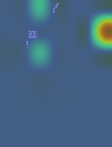

# 🃏 Blackjack Atari Agent - DARQN + Attention


> Un agent d'Apprentissage par Renforcement Profond (Deep RL) capable de jouer au Blackjack sur l'environnement Atari (`ALE/Blackjack-v5`).

## 📺 Démo (Attention Map)

Voici ce que l'agent "regarde" pendant qu'il joue. La carte de chaleur (heatmap) rouge indique les zones d'attention du réseau de neurones :



*(Si le GIF ne s'affiche pas, assurez-vous d'avoir lancé `test.py` pour le générer)*

## 🧠 Architecture du Modèle

Ce projet utilise une architecture **DARQN (Deep Attention Recurrent Q-Network)**. Contrairement à un DQN classique, ce modèle est conçu pour les environnements où l'information est partielle ou nécessite une mémoire à court terme.


### Pourquoi cette architecture ?
Le Blackjack n'est pas seulement visuel, il est **séquentiel**.
1.  **CNN (Convolutional Neural Network)** : Traite l'image brute (pixels) pour extraire les caractéristiques visuelles.
2.  **Attention Mechanism** : Permet au réseau de se focaliser uniquement sur les cartes et d'ignorer le fond décoratif du casino Atari.
3.  **LSTM (Long Short-Term Memory)** : Retient l'historique de la main (quelles cartes ont déjà été tirées) pour prendre une décision éclairée (Hit ou Stick).

## 📂 Structure du Projet

```text
blackjack_darqn/
│
├── checkpoints/             # Sauvegarde des poids du modèle (.pth)
├── logs/                    # Logs d'entraînement
│
├── src/                     # Code source
│   ├── model.py             # Le réseau (CNN + Attention + LSTM)
│   ├── memory.py            # Replay Buffer Séquentiel
│   ├── agent.py             # L'agent (Sélection d'action & Entraînement)
│   └── utils.py             # Wrappers & Preprocessing Atari
│
├── config.py                # Hyperparamètres
├── main.py                  # Script d'entraînement
├── test.py                  # Script de visualisation
└── requirements.txt         # Dépendances
```

⚙️ Installation
1. Prérequis
Assurez-vous d'avoir Python 3.8+ installé.

2. Installation des dépendances
Installez les bibliothèques nécessaires, y compris les ROMs Atari :

Bash

pip install -r requirements.txt
Contenu du requirements.txt suggéré :

Plaintext

gymnasium[atari, accept-rom-license]
torch
torchvision
numpy
opencv-python
imageio
3. Préparation des dossiers
Créez les dossiers pour stocker les sauvegardes si ce n'est pas fait :

Bash

mkdir checkpoints
mkdir logs
🚀 Utilisation
1. Entraînement de l'Agent (main.py)
Pour lancer l'apprentissage depuis zéro. L'agent va explorer l'environnement, remplir sa mémoire et apprendre via le DARQN.

Bash

python main.py
Les modèles seront sauvegardés automatiquement dans checkpoints/ tous les X épisodes (ex: model_100.pth).

Note : L'entraînement sur pixels est long. Laissez tourner plusieurs heures pour obtenir des résultats probants.

2. Test et Visualisation (test.py)
Ce script charge un modèle entraîné, joue une partie et génère un GIF montrant ce que l'IA "regarde" grâce à la carte d'attention.

Ouvrez test.py.

Modifiez la ligne de chargement avec votre fichier .pth :

Python

# Exemple
run_test("checkpoints/model_1000.pth")
Lancez le script :

Bash

python test.py
Le résultat sera sauvegardé dans le fichier blackjack_attention.gif.